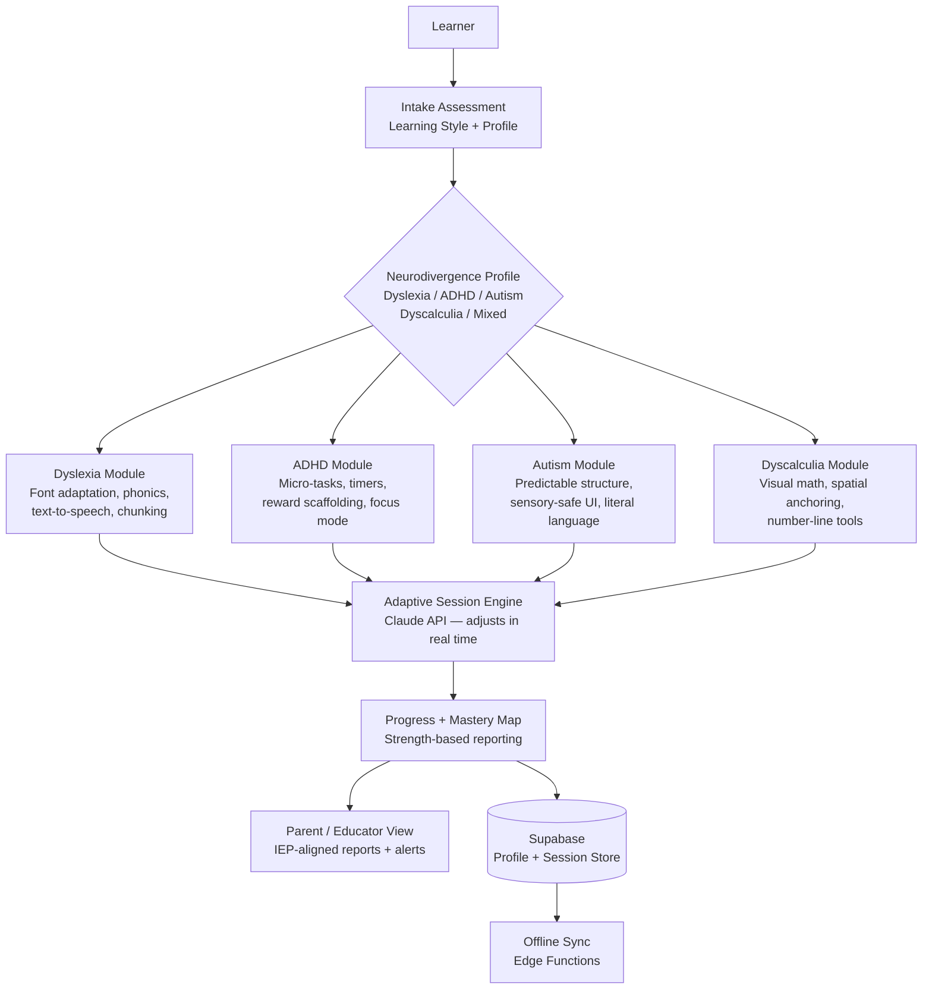

<p align="center">
  <h1 align="center">foundation-neuro-learn</h1>
  <h3 align="center"><em>Neurodivergent learning support. Dyslexia, ADHD, autism tools. 1 in 5 people.</em></h3>
</p>

<p align="center">
  <a href="LICENSE"></a>
  
  
  <a href="https://mama.oliwoods.ai"></a>
  <a href="https://mama.oliwoods.ai/foundation"></a>
</p>

---

> *"1 in 5 people is neurodivergent. Most of them spent years in classrooms believing they were broken. They weren't — the system was built for a different kind of brain."*

## Why This Exists

Neurodivergent learners — those with dyslexia, ADHD, autism spectrum conditions, dyscalculia, and processing differences — are not less intelligent. They are differently intelligent. Standard educational tools were built by neurotypical designers for neurotypical learners, creating a system that fails 20% of students at the starting line.

- **1 in 5 people** (roughly 20% of the global population) is neurodivergent in some form (Harvard Medical School, 2021)
- **80% of dyslexic learners** are never diagnosed in K-12 settings, leaving them without support for decades (Yale Center for Dyslexia & Creativity)
- **ADHD affects 5-10% of children** globally, yet fewer than 20% of affected students receive evidence-based academic accommodations (CDC, 2022)
- **Autistic adults** face a 78% unemployment or underemployment rate (Autism Society of America) — a crisis rooted in educational failure, not capability

Every feature in this project was designed by asking: "What does this learner actually need?" — not "What's easiest to build?"

## System Architecture



## Features

| Feature | Description | Research Basis |
|---------|-------------|----------------|
| **Dyslexia-Optimized Reading** | OpenDyslexic font, phonemic decoding, syllable chunking, TTS with word tracking | Orton-Gillingham method |
| **ADHD Focus Engine** | Micro-task breakdown, Pomodoro-style timers, dopamine-reward pacing, distraction-free mode | Barkley Executive Function Model |
| **Autism-Safe UI** | Predictable navigation, literal language, sensory-friendly color palettes, no sudden animations | ABA + PBIS frameworks |
| **Dyscalculia Visuals** | Number-line anchoring, spatial math tools, color-coded place value | Response to Intervention (RtI) |
| **Strength Mapping** | Progress shown as strengths gained, not deficits counted | Positive Psychology / UDL |
| **IEP Report Generation** | Auto-formatted reports aligned to IDEA / Section 504 requirements | IDEA 2004 |
| **Multi-Modal Input** | Voice, touch, keyboard, or switch-access input supported | WCAG 2.1 AA + AAA |
| **No Time Pressure** | All sessions untimed by default; pacing fully learner-controlled | Cognitive Load Theory |

## Research Foundation

| Citation | Finding | Relevance |
|----------|---------|-----------|
| Yale Center for Dyslexia (2022) | Intensive phonemic intervention closes 80% of reading gaps | Dyslexia module design |
| Barkley, R.A. (2020) | ADHD is a disorder of executive function, not attention or motivation | ADHD feature architecture |
| Lord et al. (2022) | Predictability and structure are the highest-impact classroom interventions for autism | Autism module UX |
| CAST (2023) | Universal Design for Learning increases achievement for ALL students, not just disabled | Core architecture principle |

## Quick Start

```bash
git clone https://github.com/OliWoods-Org/foundation-neuro-learn.git
cd foundation-neuro-learn
npm install
npm run dev
```

## Tech Stack

- **Runtime:** Node.js + TypeScript
- **Validation:** Zod schemas
- **Database:** Supabase (PostgreSQL)
- **AI:** Claude API / local LLM (offline mode)
- **Accessibility:** WCAG 2.1 AA + AAA, ARIA, switch-access compatible
- **Alerts:** Twilio (SMS/WhatsApp), Resend (email)

## Contributing

We especially welcome contributions from neurodivergent developers, educators, special ed teachers, and occupational therapists. Lived experience is a qualification here.

1. Fork the repo
2. Create a feature branch (`git checkout -b feat/amazing-feature`)
3. Commit your changes
4. Push and open a PR

## License

AGPL-3.0 — Free to use, modify, and distribute.

---

<p align="center">
  <strong>Built by the <a href="https://oliwoods.ai">OliWoods Foundation</a></strong><br>
  <em>Free forever. Open source. Because 1 in 5 people deserve tools that work the way they think.</em>
</p>
